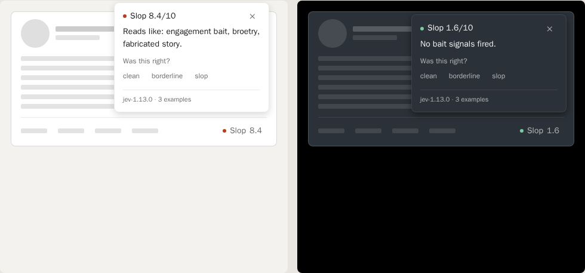
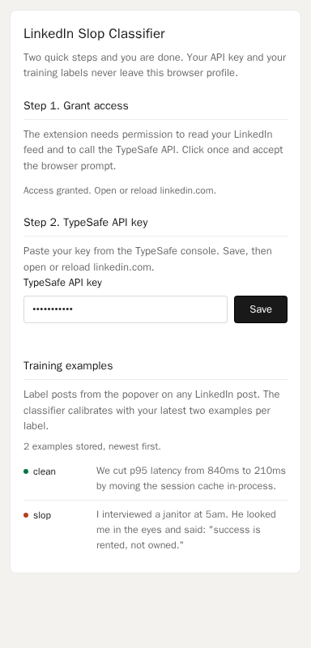
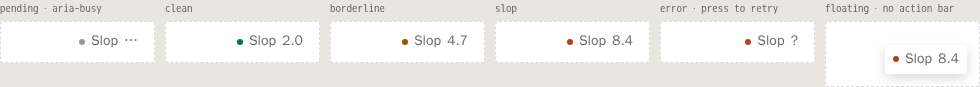

# chamuy0

A small Firefox and Chrome extension that scores every post in your LinkedIn feed, so you can skip the engagement bait and read what is actually worth your time. It shows a chip on each post, explains the score when you click, and learns from every label you give it.

**LinkedIn only for now.** More platforms are planned, but today the extension runs on LinkedIn.



## What you get

- A chip on every post: `✓ 1.6 clean`, `≈ 3.4 borderline`, or `☣ 8.4 slop`.
- A breakdown with the eight signals behind the score: engagement bait, rage bait, humblebrag, AI generic, corporate buzzwords, broetry, fabricated story, manufactured hook.
- A Train row in the popover. Label a post clean, borderline or slop, and the next classifications use your latest labels as reference.

## Install on Firefox (about two minutes)

1. Download the latest release: [Releases](https://github.com/tsu-ld/chamuy0/releases/latest).
2. In Firefox, open a new tab and go to `about:debugging#/runtime/this-firefox`.
3. Click **Load Temporary Add-on…** and select the zip you downloaded. If Firefox does not accept the zip, unzip it first and select `manifest.json` inside the folder.
4. The setup page opens by itself. Paste your TypeSafe API key and click **Save**.
5. Open [linkedin.com](https://www.linkedin.com). Chips appear as posts load.

> Firefox removes temporary add-ons when it closes. To load it again, repeat steps 2 and 3. It takes five seconds and you never paste the key twice.
>
> Later, the toolbar icon opens the same settings as a small popup.



## Install on Chrome, Edge or Brave

1. Download and unzip the same release zip.
2. Open `chrome://extensions` and turn on **Developer mode** (top right).
3. Click **Load unpacked** and select the unzipped folder.
4. Click the extension icon to open the settings popup and paste your TypeSafe API key.

## Your TypeSafe API key

The scoring is done by [Jev](https://typesafe.ai), a model that only makes decisions, so it cannot write text or hallucinate. Jev is in early access. Get a key from the TypeSafe console, then paste it in the extension settings.

The key and your training labels stay in your browser profile. The only thing that leaves your browser is the post text sent to `api.typesafe.ai` for scoring. No analytics, no server, no account.

Cost is about $0.042 per million input tokens. A full day of scrolling costs a fraction of a cent.

## Using it



- `...` means the post is being scored. Posts shorter than 40 characters are skipped.
- Click the chip for the popover: the score out of 10, the verdict, and the eight signals sorted by confidence.
- **Train** is how it learns. Label a couple of posts, then open the settings page to see your examples. The classifier uses your latest two per label on every later request.

Score bands: below 2.5 is clean, 2.5 to 5 is borderline, 5 and up is slop.

## Notes and troubleshooting

- **The chip never appears.** Make sure you are on linkedin.com and reload the tab after installing or updating the extension. The content script logs how many posts it found: open the browser console on linkedin.com and look for `[lnslop]`.
- **The chip shows `!`.** The classifier was not reachable. Click the chip to retry. If it persists, check the key in the settings page.
- **A post has no chip.** Posts without text (images only) or shorter than 40 characters are skipped on purpose.
- **Permanent install on Firefox.** Regular Firefox only keeps signed add-ons. Two options: use Firefox Developer Edition or Nightly with `xpinstall.signatures.required` set to `false` in `about:config`, or sign the zip yourself on [addons.mozilla.org](https://addons.mozilla.org) (choose "On your own", it is free and does not list the add-on publicly). The zip is already structured for signing.
- **Permanent install on Chrome.** Loaded folders stay installed. That is all.

## Development

Requires [Bun](https://bun.sh).

```sh
bun install
bun run check   # typecheck, eslint, depcruise, knip, jscpd, tests
bun run build   # bundles extension/dist; the committed build is what users load
bun run eval    # scores fixtures/posts.json against the live API (needs .env)
```

- `core/` is the classifier: rubric, Jev client, calibration pool. It never touches the browser.
- `extension/` is the browser layer: background, content script, settings popup.
- `fixtures/posts.json` is the labeled eval set. `dev/eval.ts` prints agreement per post.
- `dev/preview.html` renders every chip state and popover without LinkedIn.
- `dev/fixture-feed.html` mimics the current LinkedIn feed DOM, including the hashed-class 2026 version, to test the selectors without logging in.
- `scripts/check`, `scripts/build`, `scripts/package` and `scripts/release <patch|minor|major>` follow the release flow used in my other repos.

The rubric lives in `core/rubric.ts`: one score question with ten levels, eight yes/no signal questions, and two thresholds. Everything else is wiring. If you want to change what counts as slop, that is the file to edit.

This README scored 0.5/10 on the classifier it describes, which feels about right.
