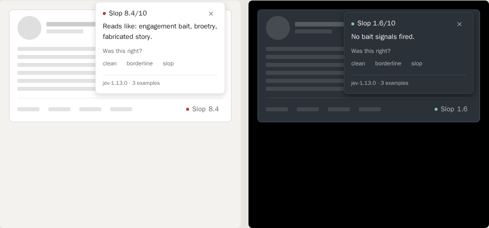
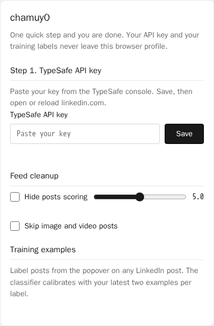
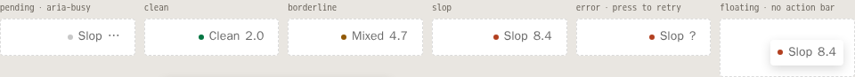

# chamuy0

A small Firefox and Chrome extension that scores every post in your LinkedIn feed, so you can skip the engagement bait and read what is actually worth your time. It shows a chip on each post, explains the score when you click, and learns from every label you give it.

**LinkedIn only for now.** More platforms are planned, but today the extension runs on LinkedIn.

**In review.** Submitted to the Chrome Web Store and addons.mozilla.org. Until the listings are live, install from the release zip below.



## What you get

- A chip on every post: `Clean 1.6`, `Mixed 3.4`, or `Slop 8.4`.
- A breakdown that always names the main tell, then the ten signals behind it: engagement bait, sponsored or collab, rage bait, hot take, humblebrag, AI generic, corporate buzzwords, broetry, fabricated story, manufactured hook.
- A Train row in the popover. Label a post clean, borderline or slop, and the next classifications use your latest labels (with their comment or media context) as reference.

## Install on Firefox (about two minutes)

1. Download the latest release: [Releases](https://github.com/tsu-ld/chamuy0/releases/latest).
2. In Firefox, open a new tab and go to `about:debugging#/runtime/this-firefox`.
3. Click **Load Temporary Add-on…** and select the zip you downloaded. If Firefox does not accept the zip, unzip it first and select `manifest.json` inside the folder.
4. The setup page opens by itself. The free trial starts automatically; you can also paste your own TypeSafe API key and click **Save**.
5. Open [linkedin.com](https://www.linkedin.com). Chips appear as posts load.

> Firefox removes temporary add-ons when it closes. To load it again, repeat steps 2 and 3. It takes five seconds and you never paste the key twice.
>
> Later, the toolbar icon opens the same settings as a small popup.



## Install on Chrome, Edge or Brave

1. Download and unzip the same release zip.
2. Open `chrome://extensions` and turn on **Developer mode** (top right).
3. Click **Load unpacked** and select the unzipped folder.
4. Click the extension icon to open the settings popup. The free trial starts automatically; paste your own TypeSafe API key if you prefer.

## Free trial, subscription, or your own key

A fresh install gets a 1-day free trial with nothing to set up: posts are scored through a small proxy of ours that holds our own Jev key. After the trial you have two options.

- **Subscribe** for $2/month or $10/year from the settings popup (Mercado Pago charges the peso amount, ARS 3.000 or 15.000). Payment and cancellation go through Mercado Pago, and there is no account: this install is remembered by a random token, kept in your browser profile and synced across your signed-in browsers when browser sync is on.
- **Use your own TypeSafe API key.** Free forever. Paste it in the settings and nothing goes through our server.

The scoring is done by [Jev](https://typesafe.ai), a model that only makes decisions, so it cannot write text or hallucinate. Jev is in early access. Get a key from the TypeSafe console if you want to bring your own.

Your key and your training labels stay in your browser profile. In trial or subscription mode the post text passes through our proxy on its way to `api.typesafe.ai`; with your own key it goes straight there. Together with the post text go its kind (feed post or comment) and media metadata (image, video or document, plus a label when the page exposes one). The proxy keeps a hashed device fingerprint and a truncated network address only to stop trial restarts, and a daily counter per token. No analytics, no account. Details in [PRIVACY.md](PRIVACY.md).

Cost with your own key is about $0.042 per million input tokens. A full day of scrolling costs a fraction of a cent.

## Using it



- `...` means the post is being scored. A post needs at least 40 characters of text, or 10 characters plus an image, video or document; comments are judged as comments, and a short caption over media is not bait by itself.
- Click the chip for the popover: the verdict, the score out of 10, the main tell, and the signals that fired.
- **Train** is how it learns. Label a couple of posts, then open the settings page to see your examples. The classifier uses your latest two per label on every later request.

Score bands: below 2.5 is clean, 2.5 to 5 is borderline, 5 and up is slop.

## Notes and troubleshooting

- **The chip never appears.** Make sure you are on linkedin.com and reload the tab after installing or updating the extension. The content script logs how many posts it found: open the browser console on linkedin.com and look for `[lnslop]`.
- **The chip shows `!`.** The classifier was not reachable. Click the chip to retry. If it persists, check the key in the settings page.
- **A post has no chip.** Posts without text (images only) or shorter than the thresholds above are skipped on purpose. You can also turn media posts off entirely with **Skip image and video posts** in the settings.
- **Permanent install on Firefox.** Regular Firefox only keeps signed add-ons. Two options: use Firefox Developer Edition or Nightly with `xpinstall.signatures.required` set to `false` in `about:config`, or sign the zip yourself on [addons.mozilla.org](https://addons.mozilla.org) (choose "On your own", it is free and does not list the add-on publicly). The zip is already structured for signing.
- **Permanent install on Chrome.** Loaded folders stay installed. That is all.

## Development

Requires [Bun](https://bun.sh).

```sh
bun install
bun run check   # typecheck, eslint, depcruise, knip, jscpd, tests
bun run build   # bundles extension/dist; the committed build is what users load
bun run eval    # scores fixtures/posts.json against the live API (needs .env)
```

- `core/` is the classifier: rubric, Jev client, calibration pool. It never touches the browser.
- `extension/` is the browser layer: background, content script, settings popup.
- `worker/` moved out: the trial and subscription proxy lives in its own repo, `../api`.
- `fixtures/posts.json` is the labeled eval set (all synthetic; no real people or post text). `dev/eval.ts` prints agreement per post and exits non-zero when a clean fixture reads as slop or the other way around.
- `dev/preview.html` renders every chip state and popover without LinkedIn.
- `dev/fixture-feed.html` mimics the current LinkedIn feed DOM, including the hashed-class 2026 version, to test the selectors without logging in.
- `scripts/check`, `scripts/build`, `scripts/package` and `scripts/release <patch|minor|major>` follow the release flow used in my other repos.

### The trial and subscription API

The proxy lives in its own repo, `../api` (`chamuy0-api`), deployed at `https://chamuy0-api.t-su.workers.dev`. Its README covers the D1 setup, the secrets, deployment and the Mercado Pago steps. The worker URL in `extension/entitlement.ts` must match the host permission in `extension/manifest.json`.

The rubric lives in `core/rubric.ts`: one score question with ten levels, one main-tell choice question, ten yes/no signal questions, and the clean/slop thresholds. A post that scores borderline or worse can never come back with `none` as its main tell, and a sponsored or hot-take main tell floors the score into the slop band. `core/post.ts` defines the context (post or comment, media kind) that travels with every request. Everything else is wiring. If you want to change what counts as slop, the rubric is the file to edit.

This README scored 0.5/10 on the classifier it describes, which feels about right.
